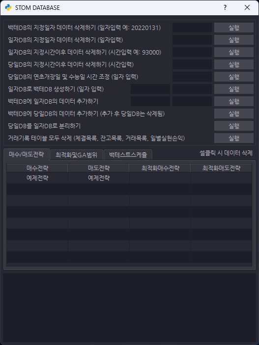

# STOM (System Trade Operating Machine)
### 개요
- STOM은 1초스냅샷 또는 1분봉 데이터를 기반으로 하는 단타 전용 시스템트레이딩툴입니다.
- 단순한 자동매매를 넘어 강력한 백테스트, 최적화, 전진분석, 주문관리시스템이 적용되어 있습니다.
- LS증권 국내주식, ETF, ETN, 국내선물, 해외선물 및 업비트, 바이낸스선물 거래소의 API가 연동되어 있습니다.
### 전략 및 최적화
- 파이썬 기본 문법 정도만 배우면 누구나 쉽게 전략을 작성할 수 있습니다.
- 전략 텍스트의 버전관리(버전번호 자동넘버링 및 텍스트 비교) 시스템을 통해 전략을 쉽게 관리할 수 있습니다.
- 버튼만 누르면 조건이 작성되는 230여개의 전략모듈이 있으며 사용자 팩터를 만들 수 있는 수식관리자가 있습니다.
- 수식관리자는 단순한 차트 표시용이 아니라 작성한 수식명 그대로 전략 및 백테에서 사용이 가능합니다.
- 최적화 알고리즘은 그리드, 유전, 교차검증, 베이지안을 지원하며 OPTUNA의 각종 샘플러까지 사용할 수 있습니다.
### 분석 시스템
- 1초스냅샷 데이터 기반 전략과 백테스트에 시장미시구조분석과 리스크분석 시스템을 제공합니다.
- 시장미시구조분석은 호가데이터를 기반으로 호가깊이비율, 불균형, 집중도, 압력레벨, 각종 조작 패턴을 분석합니다.
- 리스크분석은 체결데이터를 기반으로 RSI, 변동성, 모멘텀, 체결강도, 수량불균형, 가격위치, 각종 추세를 분석합니다.
- 1분봉 데이터 기반 전략과 백테스트에 패턴분석과 가격대분석 시스템을 제공합니다.
- 패턴분석은 talib 라이브러리에 있는 60여개의 패턴을 활용하여 종목별 패턴 발생과 이후 등락율을 분석합니다.
- 가격대분석은 설정한 가격대분할 퍼센트로 분할한 가격대에서 기준퍼센트 이상의 돌파 및 반등 이벤트를 분석합니다.
### 접근성
- 어렵고 복잡하며 단순 반복적인 코딩은 그만하시고 전략연구에 몰두하십시오.
- STOM은 사용자 친화적인 UI와 프로그램내에 많은 예제와 도움말이 포함되어 있어 누구나 쉽게 사용할 수 있습니다. 
- STOM LIVE 탭에서는 사용자들의 당일실현손익 및 백테결과를 확인할 수 있습니다.
- 설치 및 사용방법을 포함한 STOM에 대한 모든 강의는 아래 유튜브에 공개되어 있습니다.
- [**STOM YouTube**](https://www.youtube.com/@stomlive)
- [**STOM Community**](https://cafe.naver.com/stom)
### 파이썬 및 라이브러리 설치 방법
- https://www.python.org/downloads/windows/ 에서 Python 3.13.** 64비트 버전 설치
- pip_install.bat 파일 실행으로 라이브러리 설치
- stom.bat 실행 후 시리얼키 입력, LS증권 RESTAPI 또는 업비트, 바이낸스 계정 설정
- 윈도우 작업스케쥴러에 stom_login.bat 등록하여 자동 실행
- 국내주식의 경우 상장주식수 조회 및 실시간시세 등록하는데 20분 정도 소요되니 8시 35분 이전으로 스케쥴 등록
- 그외 자세한 사항은 유튜브 강의를 참고하시길 바랍니다.
- 유튜브 강의는 현재 V2.0 기준 강의이며 V3.0 기준 강의는 새로 녹화해서 차차 업로드하겠습니다.
### 라이선스 및 시리얼키
- STOM은 시스템트레이딩을 위한 도구일뿐이며 전략을 제공하거나 판매하지 않습니다.
- 소스코드의 원본 또는 수정본을 상업적으로 이용할 수 없습니다.
- 위반 시 모든 권한이 박탈되며 저작권 위반에 대한 법적 책임이 따를 수 있습니다.
- 국내주식 데이터를 타인에게 공유할 경우 코스콤과 법적 다툼이 생길 수 있습니다.
- 업데이트는 부가적으로 제공되는 것이며 영구 지속되지 않을 수 있습니다.
- 사용상 발생한 불이익은 사용자 본인의 책임입니다.

|   버전   |    시리얼키     |  실행제한  | 커뮤니티카페 | 구글드라이브 | 단톡방 |
|:------:|:-----------:|:------:|:------:|:------:|:---:|
| **무료** | STOM_PUBLIC | IP당 1개 |   O    |   X    |  X  |
| **유료** |  구독결재 발급키   | 제한 없음  |   O    |   O    |  O  |
- **무료버전 사용방법**: 설정탭 시리얼키 입력란에 STOM_PUBLIC이라고 입력 후 저장
- 커뮤니티용 카페는 누구나 자유롭게 이용할 수 있습니다. (자유가입, 자동등업)
- 데이터 공유용 구글드라이브 및 단톡방은 구독결재 후에 이용할 수 있습니다.
- [**구독결재문의**](https://cafe.naver.com/stom)
- [**비지니스문의**](mailto:youseonho@naver.com)
### 프로젝트 구조
```
STOM/
│
├── _database/                          # 데이터베이스용 폴더
│   ├── code_info.db                    # 거래소별 종목정보 저장용 DB
│   ├── setting.db                      # 설정 저장용 DB
│   ├── strategy.db                     # 전략 저장용 DB
│   ├── backtest.db                     # 백테스트 결과 저장용 DB
│   ├── optuna.db                       # OPTUNA 최적화 결과 저장용 DB
│   ├── tradelist.db                    # 체결목록, 거래목록, 당일실현손익, 잔고목록용 DB
│   └── strategy_versions/              # 전략 버전 관리 시스템용 폴더
│
├── _log/                               # 로그 폴더
│
├── ai_agent/                           # AI 에이전트
│   ├── plan/                           # 작업 계획 저장 폴더
│   ├── report/                         # 전략분석, 백태결과분석, 실매매분석 보고서 저장 폴더
│   ├── strategy/                       # AI가 생성한 전략 저장 폴더
│   ├── ruled.md                        # AI 에이전트 규칙용 파일
│   └── strategy.txt                    # 전략 작성 방법 및 변수 설명
│
├── backtest/                           # 백테스트 엔진
│   ├── _graph/                         # 백테스트 결과 그래프 저장
│   ├── _temp/                          # 분할로딩용 임시 폴더
│   ├── binance/                        # 바이낸스선물 백테스트 엔진
│   ├── future/                         # 국내선물 백테스트 엔진
│   ├── future_oversea/                 # 해외선물 백테스트 엔진
│   ├── stock_korea/                    # 국내주식 백테스트 엔진
│   ├── stock_usa/                      # 해외주식 백테스트 엔진
│   ├── upbit/                          # 업비트 백테스트 엔진
│   ├── back_code_test.py               # 전략 문법 오류 및 변수 사용 오류 확인
│   ├── back_static.py                  # 백테스트 공통 함수
│   ├── back_static_numba.py            # 백테스트엔진용 numba 함수
│   ├── back_subtotal.py                # 중간 집계용 프로세스 클래스
│   ├── backengine_base.py              # 주문관리 미적용 백테스트 엔진 베이스 클래스
│   ├── backengine_base_oms.py          # 주문관리 적용 백테스트 엔진 베이스 클래스
│   ├── backfinder.py                   # 백파인더
│   ├── backtest.py                     # 백테스트
│   ├── optimiz.py                      # 그리드, 검증, 교차검증, OPTUNA 최적화 및 최적화 테스트 
│   ├── optimiz_3d_visualization.py     # 최적화용 3D 시각화
│   ├── optimiz_conditions.py           # 조건 최적화
│   ├── optimiz_genetic_algorithm.py    # 유전 알고리즘(GA) 최적화
│   └── rolling_walk_forward_test.py    # 전진분석
│
├── dashboard/                          # 웹대시보드
│   ├── backend/                        # 백엔드
│   ├── frontend/                       # 프론트엔드
│   └── dashboard_starter.py            # 백엔드, 프론트엔드 실행
│
├── strategy/                           # 전략 및 분석 모듈
│   ├── analyzer_microstruc.py          # 시장미시구조 분석
│   ├── analyzer_pattern.py             # 패턴 분석
│   ├── analyzer_risk.py                # 리스크 분석
│   ├── analyzer_volume_profile.py      # 가격대(볼륨 프로파일) 분석
│   ├── manager_formula.py              # 수식관리자
│   └── stg_globals_func.py             # 전략 기반 클래스(230여개의 전략 모듈)
│
├── trade/                              # 실시간 트레이딩 모듈
│   ├── binance/                        # 바이낸스선물 API 연동
│   ├── future/                         # 국내선물 API 연동
│   ├── future_oversea/                 # 해외선물 API 연동
│   ├── stock_korea/                    # 국내주식 API 연동
│   ├── stock_usa/                      # 해외주식 API 연동
│   ├── upbit/                          # 업비트 API 연동
│   ├── base_receiver.py                # 리시버용 베이스 클래스
│   ├── base_strategy.py                # 전략연산용 베이스 클래스
│   ├── base_trader.py                  # 트레이더용 베이스 클래스
│   ├── restapi_binance.py              # 바이낸스선물 API 연동
│   ├── restapi_ls.py                   # LS증권 API 연동
│   ├── restapi_lsdata.py               # LS증권 API 데이터
│   └── restapi_upbit.py                # 업비트 API 연동
│
├── ui/                                 # UI
│   ├── _icon/                          # 아이콘 리소스
│   ├── create_widget/                  # 위젯 생성
│   ├── draw_chart/                     # 차트 그리기
│   ├── etcetera/                       # 기타 이벤트 처리
│   ├── event_activate/                 # 콤보박스 액티브 이벤트 처리
│   ├── event_change/                   # 체인지 이벤트 처리
│   ├── event_click/                    # 마우스 클릭 이벤트 처리
│   ├── event_keypress/                 # 키보드 입력 이벤트 처리
│   ├── update_widget/                  # 웨젯 업데이트 이벤트 처리
│   └── main_window.pyd                 # 메인 UI 및 시리얼키 인증 클래스
│
├── utility/                            # 공통 유틸리티
│   ├── _imagefiles/                    # 각종 스크린샷
│   ├── _pycharm/                       # 파이참 규칙 및 테마
│   ├── db_control/                     # 데이터베이스 관리 모듈
│   ├── settings/                       # 설정 관리 모듈
│   ├── static_method/                  # 공통 함수 사용 모듈
│   └── sub_process_and_thread/         # 서브 프로세스 및 스레드 모듈
│
├── _license.txt                        # 라이선스 파일
├── _update.txt                         # 업데이트 목록
├── pip_install.bat                     # 라이브러리 설치
├── pip_install_wd.bat                  # 웹대시보드용 라이브러리 설치
├── stom.bat                            # 메인 실행용 배치 파일
├── stom.py                             # 메인 UI 실행 파일
└── stom_login.bat                      # 자동 로그인 모드로 실행용 배치 파일
```
## 시스템 요구사항
### 트레이딩 용도
|   항목    | 최소 사양              | 권장 사양                 |
|:-------:|:-------------------|:----------------------|
| **CPU** | Intel i5 / Ryzen 5 | Intel i7 / Ryzen 7 이상 |
| **RAM** | 8GB                | 16GB 이상               |
| **인터넷** | 10Mbps             | 50Mbps 이상             |
### 백테스트 용도
|    항목    | 최소 사양                    | 권장 사양                         |
|:--------:|:-------------------------|:------------------------------|
| **CPU**  | Intel i7 / Ryzen 7 (8코어) | Intel i9 / Ryzen 9 이상 (16코어+) |
| **RAM**  | 32GB                     | 64GB                          |
| **저장공간** | NVMe 500GB               | NVMe 1TB 이상                   |
## STOM 주요 화면 및 기능
### 홈 화면: 주요 지수 및 시장 지표

### 메인 트레이딩 화면: 관심종목, 체결목록, 잔고목록, 잔고평가, 거래목록, 실현손익

### 거래집계: 일별, 월별, 연도별 집계

### 전략편집기: 매수/매도 전략 조건 설정 및 편집

### 백파인더: 전략에 사용할 팩터의 데이터 탐색

### 최적화편집기: 그리드 최적화, 검증 최적화, 교차검증 최적화, 옵튜나 최적화

### 테스트편집기: 각종 최적화 테스트

### 전진분석: 최적화 테스트를 반복하는 전진분석

### 변수편집기: 최적화 파라미터 설정

### 범위편집기: 최적화 파라미터의 범위 설정

### 조건편집기: 조건 조합 최적화로 전략 탐색

### GA편집기: 유전 알고리즘 최적화

### 백테스트로그: 백테스트 진행 상황 및 로그

### 상세기록: 백테스트 결과 기록 및 관리

### 백테스트 그래프 비교: 여러 전략의 백테 그래프 비교

### 백테스트 스케줄러: 여러개의 백테스트 및 최적화를 스케줄링하여 실행

### 로그: 시스템 로그 및 오류 메시지

### 설정: 기본 설정, 전략 설정, 백테 설정, 기타 설정

### 주문관리: 주문 관리 설정 및 위험 관리 설정

### STOM Live: 사용자들의 실시간 매매 및 백테 정보

### 데이터베이스 관리

### 김프

### 차트: 실시간 및 DB 차트 표시

### 수식관리자: 사용자 팩터 추가, 수식명으로 전략 및 백테에서 바로 사용 가능

### 전략모듈: Ctrl+클릭으로 버튼명 및 내용 편집 가능

### 호가창: 실시간 호가 정보 및 차트 부가 정보 표시

### 기업정보: 기업개요, 공시, 뉴스, 재무재표

### 백테스트엔진: 엔진 설정 및 실행

### 전략 버전 관리

### 업종별/테마별 트리맵

### 백테스트 결과 그래프

### 백테스트 결과 부가정보

### 웹대시보드
