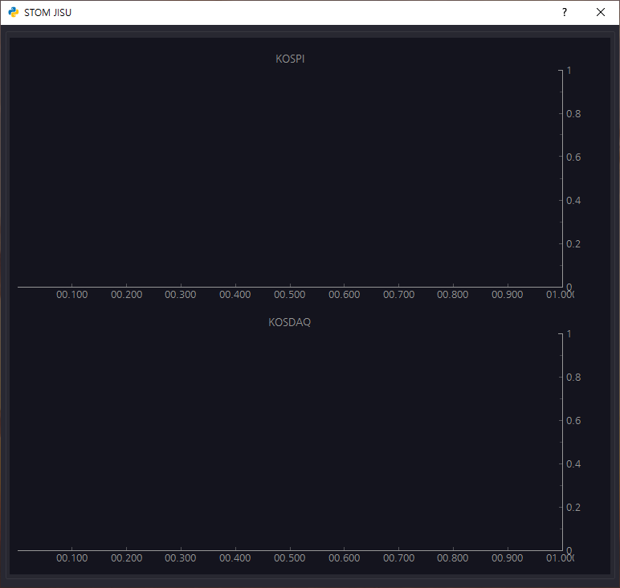
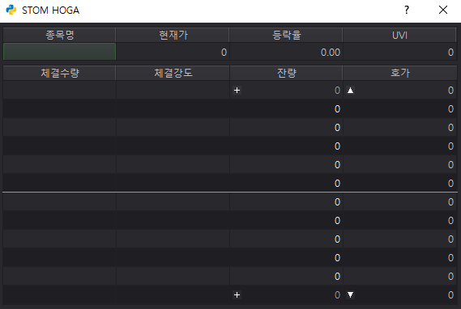
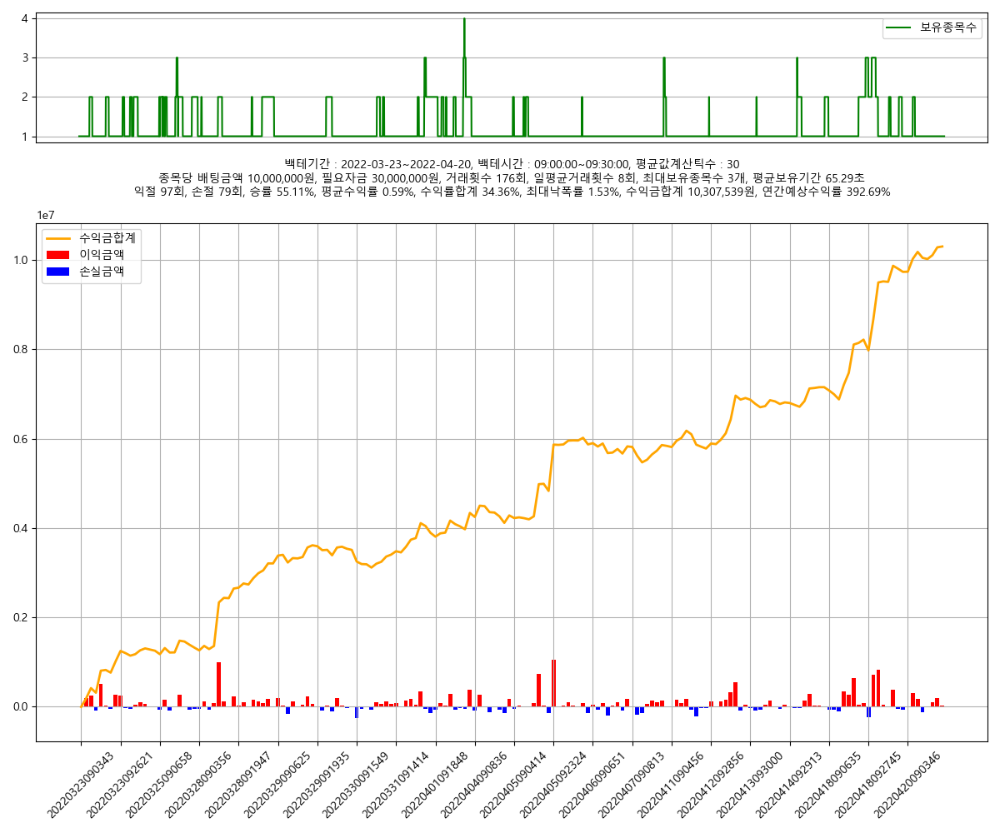
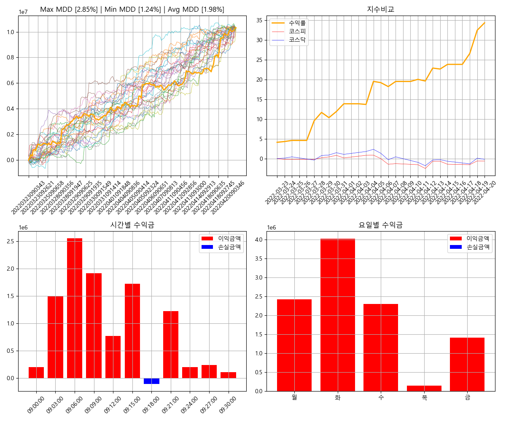
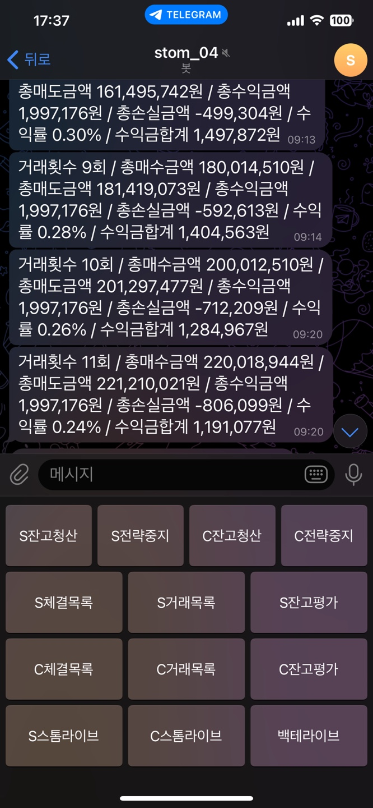

# STOM (System Trade Operating Machine)

STOM은 1초스냅샷과 1분봉 데이터를 기반으로 하는 단타 전용 시스템트레이딩툴입니다.

단순한 자동매매를 넘어 강력한 백테스팅 및 최적화 알고리즘과 주문관리시스템까지 적용되어 있으며

파이썬 기본 문법 정도만 알면 누구나 쉽게 사용할 수 있도록 설계되었습니다.

소스코드에 대한 강의는 아래 유튜브에 모두 업로드되어 있습니다.

https://www.youtube.com/@stomlive

무료 버전으로 사용하실려면 설정탭 시리얼키에 STOM_PUBLIC 으로 입력하시면 됩니다.

무료 버전은 IP 당 하나의 STOM만 실행할 수 있으며 최적화 및 전진분석을 제외한

일반 백테스트 및 백파인더만 사용할 수 있습니다.

## STOM 주요 기능 및 화면 구성

### 홈 화면

### 기본 화면

### 데이터 집계

### 전략 편집기

### 백파인더

### 최적화 편집기

### 테스트 편집기

### 전진 분석

### 변수 편집기

### 범위 편집기

### 조건 편집기

### GA 편집기

### 백테스트 로그

### 백테스트 기록

### 백테스트 그래프 비교

### 백테스트 스케줄러

### 로그 창

### 설정 창

### 주문 관리

### STOM Live

### 데이터베이스 관리

### 김프 창

### 차트 창

### 수식 관리자

### 전략 모듈

### 지수 차트

### 호가 창

### 기업 정보

### 백테스트 엔진 창

### 업종별/테마별 트리맵

### 백테스트 결과 그래프

### 백테스트 결과 부가 정보

### 텔레그램 사용자 버튼

### 시스템 다이어그램 I

### 시스템 다이어그램 II

